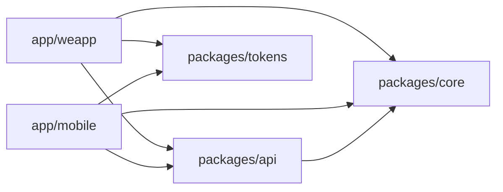

# 架构说明

## 工作区

```text
app/mobile    Expo Android / iOS 应用
app/weapp     Taro 微信小程序
packages/core 平台无关类型、错误、接口和校验
packages/api  API 客户端与可注入 Mock Transport
packages/tokens 语义化设计变量及两端样式映射
tooling       共享 TypeScript 与 ESLint 配置
```

依赖方向固定为：



共享包使用 compiled package 模式：TypeScript 编译为 ESM JavaScript 与类型声明，消费者只通过 `package.json#exports` 访问。Turbo 在应用的开发、检查与构建任务之前运行上游构建。

## 数据流

```text
页面 -> 应用内功能逻辑 -> @repo/api -> HttpTransport -> 平台请求实现
```

`HttpTransport` 接受超时和取消信号。共享 API 客户端负责 HTTP 状态与响应数据校验，页面负责把 `ApiError` 映射为适合平台的界面。当前不自动重试，避免对非幂等请求形成错误假设。

- 移动端：`fetch` + `AbortController`，设置写入 AsyncStorage。
- 小程序：`Taro.request` + `RequestTask.abort`，设置写入 Taro Storage。
- Mock：实现同一 `HttpTransport`，默认启动，无需后端。

## UI 与主题

`packages/tokens` 定义 `primary`、`background`、`surface`、`text`、`muted`、`border` 和 `danger` 等语义变量。两端只共享语义和值：

- 移动端 CSS 将变量映射给 Uniwind 与 HeroUI Native。
- 小程序 Sass 提供相同变量，页面渲染树中的 Taroify `ConfigProvider` 接收当前主题。

主题状态使用少量 React Context，并分别持久化。业务组件保留在应用中；只有出现第二个同技术栈应用且形成稳定复用需求时，才提取 UI 包。

## 扩展规则

1. 新业务优先放入各应用的 `features`，路由文件只解析参数和装配页面。
2. 可跨端复用且不依赖平台运行时的契约、校验或纯函数放入 `core`。
3. 服务调用放入 `api`，设备和微信能力通过端内适配器注入。
4. 禁止跨包相对路径和直接引用其他包的 `src`。
5. 小程序业务增长后按功能配置分包；首页和设置继续保留主包。
6. 原生差异仅在必要时使用 `.ios.tsx` 与 `.android.tsx`，其余保持单一实现。

## 发布验证

CI 固定 Node 与 pnpm，执行格式、依赖边界、类型、测试、微信生产构建以及 Android/iOS JavaScript 导出。发布前还应完成：

- Android 安装包构建与真机安装。
- iOS Xcode 或 EAS 构建与安装。
- 微信开发者工具和真机中的返回、主题、请求域名与包体积检查。
- 在平台控制台配置证书、签名和服务器请求域名；这些凭据不进入仓库。
